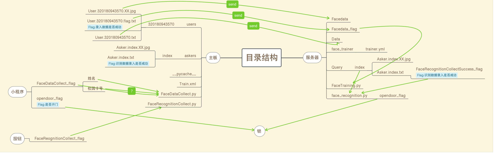

# 兰客社人脸识别门禁系统比赛后端代码

(English version is down below)

**软件著作权（我们团队合作成果，整体著作权归属兰州大学）：**

**Software Copyright(Our Team cooperation effort, whole project rights belong to Lanzhou University.)**

## 简介

我们团队在兰州大学兰客社[人脸识别门禁系统大赛](http://lanck.lzu.edu.cn/?p=456)之中荣获 **[三等奖与1000元奖金](http://lanck.lzu.edu.cn/?p=473)**，这是我们团队合作完成的比赛成果。

在比赛之中我们参考了很多资料，这里不再一一列出。我们的项目并非十分完美，存在人脸识别准确率过低等问题。现在我将后端代码开源出来，希望能够给大家一些参考。

***具体比赛细则和参考资料请参见[Materials](./Materials)文件夹，里面提供了详细的说明资料。***

这是我们的[*答辩ppt*](Lanck_Team8.pptx)

前期我们准备采用[RSTP流直播的方法](https://github.com/HollowMan6/Building-CCTV/tree/master/Building-CCTV-With-RSTP-Stream-Using-ffsever)进行远程局域网内网络实时监控的构建，但由于诸多缺点，最终放弃了这种方法，而采用[OpenCV截图转发](https://github.com/HollowMan6/Building-CCTV/tree/master/Building-CCTV-With-OpenCV-Face-Recognition-Sending-Pictures)。

我们的前端采用微信小程序进行开发。

## 下面我将对我负责编写的后端结构进行说明

[Python库依赖](../../network/dependencies)

&emsp;&emsp;我们采用OpenCV实现人脸识别功能，并且使用Socket编程。

***后端具体结构请参照这幅图：***

我们的后端分为两部分：**服务器端**和**开发板端**。

* **开发板端**：

&emsp;&emsp;录入功能中，运行[FaceDataCollect.py](./Development-Board/FaceDataCollect.py)，程序会自动截取摄像头的200张图片，发送到服务器端。要求输入姓名和校园卡号。校园卡号必须为12位。

&emsp;&emsp;识别功能中，首先在探测到有人在面前并被唤醒之后，运行[DetectBlinks.py](./Development-Board/DetectBlinks.py)，其原理是检测人是否在眨眼睛，以确定是否为真人，而非照片，从而进行活体检测。在确定为真人后，运行[FaceRecognitionCollect.py](./Development-Board/FaceRecognitionCollect.py),程序会将自动截取摄像头的20张照片，发送到服务器进行识别。

&emsp;&emsp;开发板同时还要开启接收脚本[Message-Receive.py](./Development-Board/Message-Receive.py)来接收服务器发回的识别成功或失败的数据。

* **服务器端**：

&emsp;&emsp;使用Screen窗口管理程序在后台始终运行[receive.py](./Server/receive.py)。该脚本会在接收到录入请求后，接收照片放在指定文件夹，并且在接收完毕后自动开始训练。当收到识别请求时，接受图片，进行识别，并返回数据。具体请参照源代码。

&emsp;&emsp;[WXMsgReceive.py](./Server/WXMsgReceive.py)为微信小程序端数据的接收。

# Lanck Face Recognition Lock Competition Backend Code

## Introduction

This is a version of the Lanck Face Recognition Competition Backend Code by Teamwork.

Our team won [the third prize and 1000 yuan prize](http://lanck.lzu.edu.cn/?p=473) in Lanzhou University Lanck Club *[Lanck Face Recognition Lock Competition](http://lanck.lzu.edu.cn/?P=456)*, which is the result of our team's cooperation.

We refer to a lot of information during the competition, and here are no longer listed one by one. Our project is not perfect, there are some problems such as low accuracy of face recognition. Now I open source the back-end code, hoping to give you some reference.

See the [Materials](./Materials) folder for details of the competition rules and references. Detailed instructions are provided.

Here is our *[Introducing PPT](Lanck_Team8.pptx)*

In the early stage, we were going to adopt [using ffserver and ffmpeg to RSTP live broadcast](https://github.com/HollowMan6/Building-CCTV/tree/master/Building-CCTV-With-RSTP-Stream-Using-ffsever) to build, but because of many shortcomings, we finally abandoned this method, and use [OpenCV to recognize faces and send to the other place with a picture](https://github.com/HollowMan6/Building-CCTV/tree/master/Building-CCTV-With-OpenCV-Face-Recognition-Sending-Pictures)

Our front-end is developed by Wechat applet.

## The Back-end Structure

[Python Dependencies](../../network/dependencies)

I am responsible for writing the back-end structure.

We use OpenCV to realize face recognition function, and use Socket programming.

***Please Refer to the figure for the back-end structure for more infomation.***

Our back end is divided into two parts: **server side** and **development board side**.

* **Development Board End**:

In the input function, run [FaceDataCollect.py](./Development-Board/FaceDataCollect.py), the program will automatically intercept 200 pictures of the camera and send them to the server. Please enter your name and campus card number. The campus card number must be 12.

In recognition function, first, after detecting someone in front of him or her and being waked up, run [DetectBlinks.py](./Development-Board/DetectBlinks.py). Its principle is to detect whether a person is blinking in order to determine whether it is a real person, not a photograph, so as to carry out live detection. After being identified as a real person, running [FaceRecognitionCollect.py](./Development-Board/FaceRecognitionCollect.py), the program will automatically intercept 20 photos of the camera and send them to the server for identification.

The development board also opens the receive script [Message-Receive.py](./Development-Board/Message-Receive.py) to receive data sent back by the server identifying success or failure.

* **Server Side**:

Use Screen window manager to always run [receive.py](./Server/receive.py) in the background. The script receives the input request, receives the photos and puts them in the specified folder, and starts training automatically after receiving. When the recognition request is received, the picture is accepted, the recognition is carried out, and the data is returned. Refer to the source code specifically.

[WXMsgReceive.py](./Server/WXMsgReceive.py) is the receipt of data from the Wechat applet.
